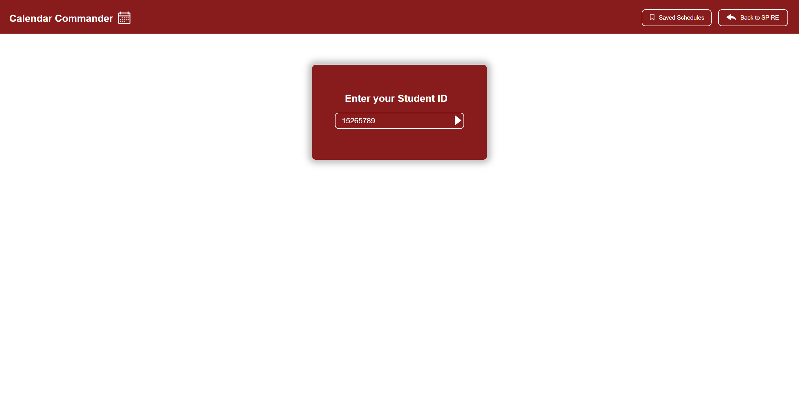
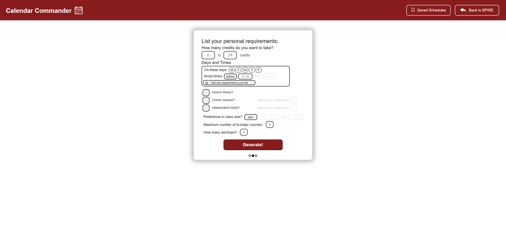
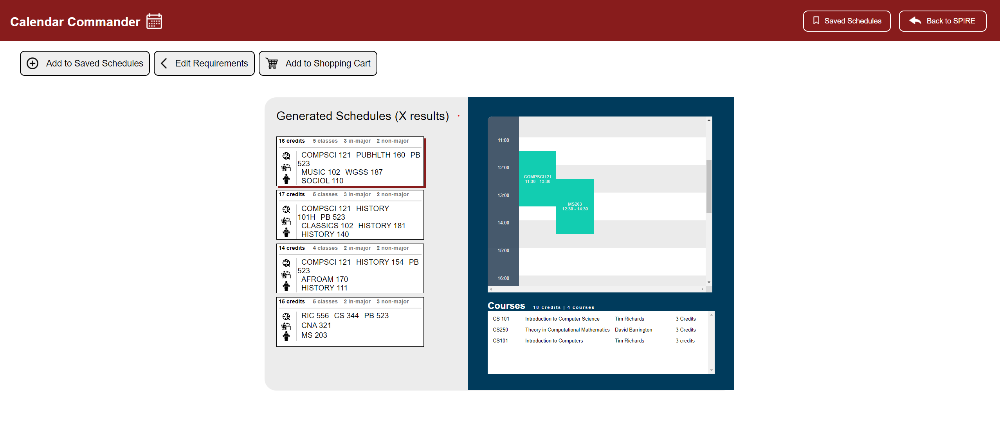

## Calendar Commander
Calendar Commander is a web application that will remove the frustration and confusion associated with creating a working schedule based on UMass Academic Requirements. The goal is to break down the ARR into a simplistic manner which simply generates suitable schedules for students that will help them graduate and understand what is required of them. Students at UMass are welcome to use this application, as it will provide a clear outline of valid next-semester schedules.

Currently, this application pulls from a publicly avaliable list of courses offered at the University of Massachusetts Amherst into the database. The application is free to make GET and POST requests to the database to retrieve and update information respectively, with the end goal being to generated an optimal schedule based on the parameters any student enters. This takes the old _Spire_ system that is highly outdated and mundane with a clean approach to schedule generation.

## Topics
 1. Data Storage - ElephantSQL to manage course/academic requirements                    and schedules for students
 2. Server-Side - Express and calculations of schedules will be done                    on the server and sent to the client
 3. Front-End  - We are using a React Framework to create the UI

## Authors
 - [Veer Singh](./team/VEER_SINGH.md)
 - [Jacob Calkins](./team/JACOB_CALKINS.md)
 - [Matthew Gimlewicz](./team/MATTHEW_GIMLEWICZ.md)
 - [Mark Dow](./team/MARK_DOW.md)

